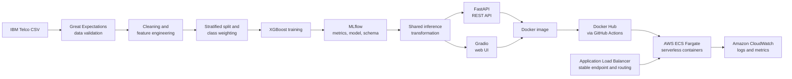

<div align="center">

# Customer Churn Prediction — End-to-End MLOps

**A production-minded machine learning system that takes a recall-focused churn model from raw data to a serverless container deployment on AWS.**

[](https://github.com/atharvahatekar/Customer-Churn-Prediction-ML_Prod/actions/workflows/ci.yml)
[](https://hub.docker.com/r/atharva2310/telco-churn)
[](https://www.python.org/)
[](LICENSE)

[Quick start](#quick-start-with-docker) · [Architecture](#system-architecture) · [AWS deployment](#aws-deployment) · [Model results](#model-results) · [Train locally](#train-the-model-locally) · [API](#use-the-api)

</div>

## Why this project exists

Predicting churn is useful; reliably delivering that prediction is the harder engineering problem. This project demonstrates the complete lifecycle of a classification system for identifying telecom customers at risk of leaving:

- validate raw data before it reaches the model;
- clean and transform customer records into a reproducible feature schema;
- train an imbalance-aware XGBoost classifier;
- track parameters, metrics, artifacts, and models with MLflow;
- serve the selected model through both a REST API and an interactive UI;
- package the application and model together with Docker; and
- automatically publish a new image to Docker Hub from GitHub Actions; and
- run the container on AWS ECS Fargate behind an Application Load Balancer, with operational visibility through CloudWatch.

The result is more than a notebook: it is a runnable, testable service that connects data science decisions to deployment.

## System architecture



### End-to-end workflow

1. **Ingest** — Load the raw Telco Customer Churn CSV with explicit file checks.
2. **Validate** — Run schema, category, null, range, and cross-column checks with Great Expectations. Training stops when validation fails.
3. **Prepare** — Remove the customer identifier, coerce numeric fields, map the target, and handle missing numeric values.
4. **Engineer features** — Deterministically encode binary fields, one-hot encode multi-category fields, and persist the final feature order.
5. **Train** — Use a reproducible stratified split and `scale_pos_weight` to account for class imbalance.
6. **Evaluate and track** — Log precision, recall, F1, ROC AUC, timing, parameters, preprocessing metadata, and the trained model to MLflow.
7. **Serve** — Apply the training feature schema at inference time, then expose predictions through FastAPI and Gradio.
8. **Deliver** — Build the application as a Docker image and publish `atharva2310/telco-churn:latest` on pushes to `main`.
9. **Deploy and observe** — Run the service on AWS ECS Fargate, route requests through an Application Load Balancer, and collect deployment logs and metrics in CloudWatch.

## Model results

The selected XGBoost run uses an 80/20 stratified split (`random_state=42`), class weighting, and a churn decision threshold of `0.35` during evaluation.

| Metric | Score |
|---|---:|
| ROC AUC | **0.837** |
| Recall | **0.921** |
| F1 score | **0.614** |
| Precision | **0.490** |
| Data quality checks | **Passed** |

### Why recall is the primary metric

The main modeling objective is **high recall**, not maximizing precision or the F1 score. In a retention use case, a false negative means failing to identify a customer who is actually about to leave. That missed customer receives no retention intervention and may represent lost recurring revenue.

The `0.35` evaluation threshold therefore makes the model more sensitive to churn risk. This deliberately accepts more false positives—and consequently lower precision—to identify a larger share of actual churners. F1 and precision are still tracked as guardrail metrics, but recall drives model selection. In a real retention program, the final threshold should also consider intervention cost and customer lifetime value.

> These figures are benchmark results from the committed MLflow run, not guarantees on future or out-of-distribution data.

## Quick start with Docker

The image already contains the selected MLflow model and its preprocessing metadata, so no training step is required.

```bash
docker pull atharva2310/telco-churn:latest
docker run --rm -p 8000:8000 atharva2310/telco-churn:latest
```

Once the container is healthy, open:

- **Interactive Gradio app:** http://localhost:8000/ui
- **Swagger API documentation:** http://localhost:8000/docs
- **Health check:** http://localhost:8000/

## AWS deployment

The containerized application has also been deployed on AWS using a managed, serverless container architecture:

| AWS service | Role in the deployment |
|---|---|
| **Amazon ECS with Fargate** | Runs the FastAPI and Gradio container without provisioning or managing EC2 instances |
| **Application Load Balancer** | Provides a stable entry point, performs health checks, and routes incoming traffic to healthy Fargate tasks |
| **Amazon CloudWatch** | Centralizes application logs and operational metrics across tasks and deployments |

The runtime request path is:

```text
Client → Application Load Balancer → ECS target group → Fargate task → FastAPI → XGBoost model
                                                    └→ CloudWatch logs and metrics
```

The service exposes port `8000`, and the root endpoint (`GET /`) returns `{"status": "ok"}` for load-balancer health checks. Fargate keeps the serving layer container-native while removing the need to operate the underlying servers.

## Use the API

Send a customer profile to `POST /predict`:

```bash
curl -X POST "http://localhost:8000/predict" \
  -H "Content-Type: application/json" \
  -d '{
    "gender": "Female",
    "Partner": "No",
    "Dependents": "No",
    "PhoneService": "Yes",
    "MultipleLines": "No",
    "InternetService": "Fiber optic",
    "OnlineSecurity": "No",
    "OnlineBackup": "No",
    "DeviceProtection": "No",
    "TechSupport": "No",
    "StreamingTV": "Yes",
    "StreamingMovies": "Yes",
    "Contract": "Month-to-month",
    "PaperlessBilling": "Yes",
    "PaymentMethod": "Electronic check",
    "tenure": 1,
    "MonthlyCharges": 85.0,
    "TotalCharges": 85.0
  }'
```

Example response:

```json
{
  "prediction": "Likely to churn"
}
```

The Pydantic request model validates the shape and types of incoming data. FastAPI generates the interactive OpenAPI documentation automatically at `/docs`.

## Train the model locally

### 1. Clone and install

```bash
git clone https://github.com/atharvahatekar/Customer-Churn-Prediction-ML_Prod.git
cd Customer-Churn-Prediction-ML_Prod

python -m venv .venv
```

Activate the environment:

```bash
# Linux/macOS
source .venv/bin/activate

# Windows PowerShell
.venv\Scripts\Activate.ps1
```

Then install the project dependencies:

```bash
python -m pip install --upgrade pip
python -m pip install -r requirements.txt
```

### 2. Add the dataset

This project uses the 7,043-row **IBM Telco Customer Churn** sample dataset. Download the CSV linked from the [original IBM churn project](https://github.com/IBM/customer-churn-prediction#3-upload-the-dataset), then save it as:

```text
.data/raw/Telco-Customer-Churn.csv
```

Raw data and local MLflow runs are excluded from version control.

### 3. Run the complete pipeline

```bash
python scripts/run_pipeline.py \
  --input .data/raw/Telco-Customer-Churn.csv \
  --target Churn \
  --threshold 0.35 \
  --test_size 0.2 \
  --experiment Telco-Churn
```

The pipeline writes:

- the cleaned dataset to `data/processed/`;
- the serving feature schema and preprocessing metadata to `artifacts/`; and
- model parameters, metrics, metadata, and the serialized model to `mlruns/`.

### 4. Explore experiments

```bash
mlflow ui --backend-store-uri ./mlruns --port 5000
```

Open http://localhost:5000 to compare runs and inspect their artifacts.

## Run the tests

```bash
python -m pytest tests -q
```

The current automated tests exercise the Great Expectations validation contract with both valid data and a deliberately invalid category.

## Repository structure

```text
.
├── .github/workflows/ci.yml       # Build and publish the Docker image
├── artifacts/                     # Feature schema and preprocessing metadata
├── Notebooks/EDA.ipynb            # Exploratory data analysis
├── scripts/
│   ├── run_pipeline.py            # Complete training and tracking pipeline
│   └── prepare_processed_data.py  # Standalone data preparation helper
├── src/
│   ├── app/main.py                # FastAPI application and Gradio UI
│   ├── data/                      # Loading and preprocessing
│   ├── features/                  # Deterministic feature engineering
│   ├── models/                    # Training, tuning, and evaluation helpers
│   ├── serving/inference.py       # Model loading and online inference
│   └── utils/validate_data.py     # Great Expectations data checks
├── tests/                         # Automated data-validation tests
├── dockerfile                     # Reproducible serving image
└── requirements.txt               # Python dependencies
```

## Production-minded design decisions

| Concern | Implementation |
|---|---|
| Bad data reaching training | Great Expectations validation gate with failures logged to MLflow |
| Imbalanced target | XGBoost `scale_pos_weight` calculated from the training split |
| Reproducibility | Fixed random seed, dependency manifest, persisted parameters and artifacts |
| Train/serve skew | Exact training feature list is saved and used to align online inputs |
| Experiment traceability | MLflow tracks data-quality status, metrics, timings, parameters, and model files |
| Multiple consumers | FastAPI and Gradio call the same inference function |
| Portable deployment | Model and service are packaged into a Python 3.11 Docker image |
| Automated delivery | GitHub Actions publishes the image to Docker Hub after a push to `main` |
| Managed cloud runtime | AWS ECS Fargate executes the container without dedicated server management |
| Stable traffic routing | An Application Load Balancer routes requests to healthy service tasks |
| Operational visibility | CloudWatch collects centralized logs and metrics across deployments |

## CI/CD

The GitHub Actions workflow:

1. checks out the repository;
2. configures Docker Buildx;
3. authenticates using `DOCKERHUB_USERNAME` and `DOCKERHUB_TOKEN` repository secrets; and
4. builds and pushes `atharva2310/telco-churn:latest`.

The published container is deployed to ECS Fargate behind the Application Load Balancer. The workflow currently automates image delivery to Docker Hub; updating the ECS service is a separate deployment step.

For a larger production system, the next steps would be to add tests as a required pre-build job, promote models through an MLflow Model Registry instead of selecting a fixed run in the image, return calibrated churn probabilities, monitor drift and service telemetry, and define infrastructure as code.

## Technology stack

**ML and data:** Python, pandas, scikit-learn, XGBoost, Optuna, Great Expectations  
**Experiment tracking:** MLflow  
**Serving:** FastAPI, Pydantic, Gradio, Uvicorn  
**Quality and delivery:** pytest, Docker, GitHub Actions, Docker Hub  
**Cloud deployment:** AWS ECS Fargate, Application Load Balancer, Amazon CloudWatch

## Author

Built by [Atharva Hatekar](https://github.com/atharvahatekar) as an end-to-end machine learning engineering portfolio project.

## License

Released under the [MIT License](LICENSE).
